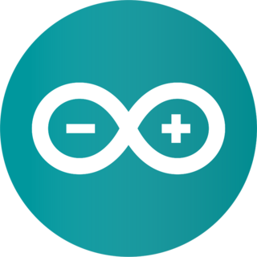
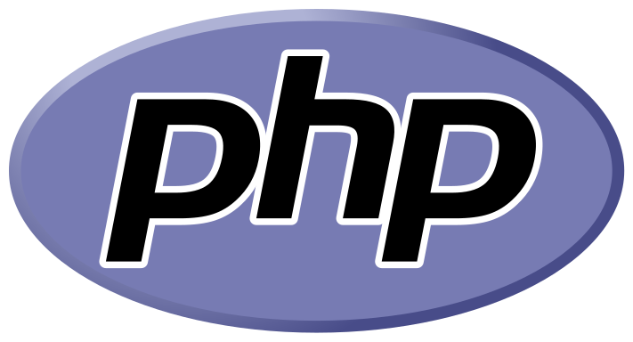

# **Software Development Fundamentals**

Website Development - PHP

---

# Course Structure

- This course uses the generic, language agnostic ```Software Development Fundamentals``` course as a base. 


- The Fundamentals course will introduce the topics / concepts for each stage, and this page has the language / platform specific implementation.

- General broad knowledge, specific skills

---


---

# What is Programming?

- Executing (running) code
- The programmer writes high level language.
- Compiler / Interpreter converts it to Hardware


---
# Syntax
```
# Python
print("Hello World")
```

```
// Arduino
Serial.println("Hello World");
```

```
PHP
<?php
echo "Hello World!";
?>
```
---
# Syntax
```
Assembly - x86 32 bit Mac OSX

global start
section .text
start:
    push    dword msg.len
    push    dword msg
    push    dword 1
    mov     eax, 4
    sub     esp, 4
    int     0x80
    add     esp, 16
    push    dword 0
    mov     eax, 1
    sub     esp, 12
    int     0x80

section .data
msg:    db      "Hello, world!", 10
.len:   equ     $ - msg
```
--- 
# Executing Code

Depending on the language and environment, there are two broad approaches to executing code - **interpreted** and **compiled**.

- **Interpreted** code is executed line by line by the interpreter.

- **Compiled** code is when the compiler analyses the entire code, checks for errors and then produces an executable

--- 
# Interpreted vs Compiled

Neither is *better*, it depends on the circumstances. 

|Compiled | Interpreted|
|---|---|
|can take time to compile the entire code base before it can execute| can allow for more flexible programming|
|once the code is running, it is generally faster.|tend to execute slower than compiled languages|

---
## Input Processing Output

Most parts of code comprise of three things:
- Input
    - User name, Mouse clicks etc.
- Processing
    - Converting data from input into desired output, etc.
- Output
    - Result of calculation, writing to a database etc.
---


---
# Key Terms

|Term|Definition|
|--|--|
|IDE|Integrated Development Environment. The program used to code, which typically provides the developer different tools to assist the development process - not just a text editor.|
|Programming|Giving instructions to the computer to execute.|

---
# Choose Your Path

[](#13) Robotics 
[](#14) Website Development (Odd years)
[Python](#13) Website Development (Even Years)
[GDScript](#13) Interactive Software Development 


---
# Arduino

NOTE!

Arduino refers to the IDE, Language AND the board!

---
# Arduino 2

---

# PHP